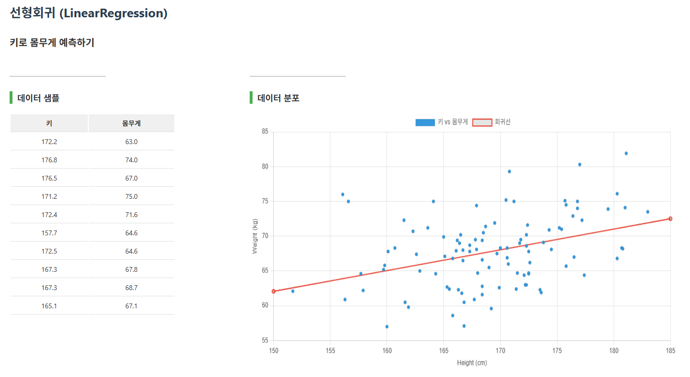
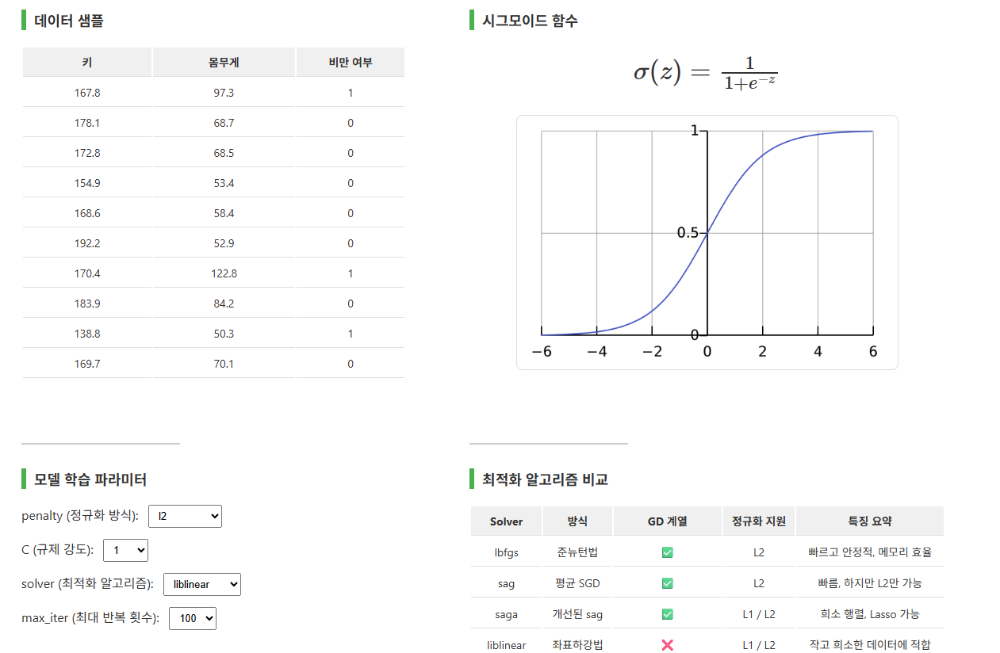
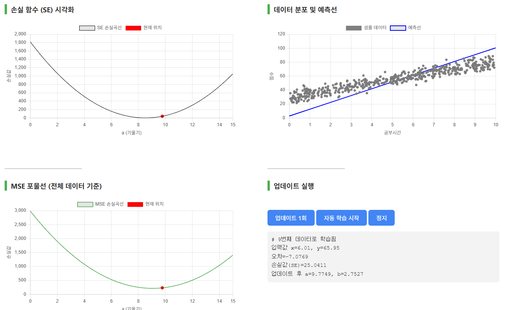

# ML-Studio

머신러닝 개념을 웹에서 시각적으로 학습할 수 있도록 만든 Flask 기반 교육용 웹앱입니다.  
회귀 알고리즘과 경사하강법 등의 개념을 페이지별로 분리하여 학습할 수 있도록 구성했습니다.
<br>
<br>


## 데모 링크

🔗 https://ml-studio.onrender.com/

> ⚠️ 무료 호스팅(Render) 환경에서 배포되어  
> 처음 접속 시 서버가 깨어나는 데 20~30초 정도 소요될 수 있습니다.
<br>
<br>


## 스크린샷

### Linear Regression
  

### Logistic Regresstion
  

### SGD Regression
  

<br>
<br>

## 프로젝트 개요

ML-Studio는 머신러닝을 처음 배우는 학습자에게  
모델의 원리와 결과를 **직관적으로 보여주는 것**을 목표로 만든 프로젝트입니다.

단순히 코드만 보여주는 것이 아니라,

- 알고리즘별 페이지 분리
- 입력값 조절
- 데이터 확인
- 결과 시각화
- 예측 결과 출력

과 같은 흐름을 웹에서 확인할 수 있도록 설계했습니다.

<br>
<br>

## 주요 기능

- 머신러닝 학습용 메인 페이지 제공
- 선형회귀 시각화 및 예측
- 로지스틱 회귀 시각화 및 예측
- Ridge / Lasso 회귀 학습 페이지 구성
- SGDRegressor 관련 학습 페이지 구성
- Gradient Descent 학습 페이지 구성
- CSV 데이터와 모델 파일을 활용한 실습형 구성

<br>
<br>

## 기술 스택

### Backend
- Python
- Flask

### Machine Learning
- scikit-learn
- pandas
- numpy
- matplotlib

### Frontend
- HTML
- CSS
- JavaScript

### Deployment
- Render

<br>
<br>

## 프로젝트 구조

```text
ML-Studio/
├─ app.py
├─ requirements.txt
├─ data/
├─ model/
├─ routes/
│  ├─ linear.py
│  ├─ logistic.py
│  ├─ ridge.py
│  ├─ lasso.py
│  ├─ sgdregressor.py
│  └─ gd.py
├─ static/
└─ templates/
```

<br>
<br>

## 구현한 학습 주제

현재 저장소 구조 기준으로 다음 주제를 페이지별로 구성했습니다.

- Linear Regression
- Logistic Regression
- Ridge Regression
- Lasso Regression
- SGDRegressor
- Gradient Descent

<br>
<br>

## 실행 방법

### 1) 저장소 클론

```bash
git clone https://github.com/JM-alpha8/ML-Studio.git
cd ML-Studio
```

### 2) 가상환경 생성 및 활성화

```bash
python -m venv venv
```

Windows:

```bash
venv\Scripts\activate
```

macOS / Linux:

```bash
source venv/bin/activate
```

### 3) 패키지 설치

```bash
pip install -r requirements.txt
```

### 4) 실행

```bash
python app.py
```

브라우저에서 아래 주소로 접속합니다.

```text
http://127.0.0.1:5000
```

<br>
<br>

## 라우팅 구조

`app.py`에서 각 알고리즘별 Blueprint를 등록해 페이지를 구성했습니다.

예:

- `linear_bp`
- `logistic_bp`
- `ridge_bp`
- `lasso_bp`
- `sgdregressor_bp`
- `gd_bp`

이 구조를 통해 기능이 늘어나더라도 알고리즘별로 파일을 분리해 관리할 수 있도록 했습니다.

<br>
<br>

## 이 프로젝트의 의미

이 프로젝트는 단순한 머신러닝 실습 코드 모음이 아니라,  
**머신러닝 개념을 설명 가능한 웹 형태로 바꿔보는 시도**에 가깝습니다.

특히 다음과 같은 점에 의미를 두었습니다.

- 알고리즘을 강의용으로 설명하기 쉬운 형태로 정리
- Python 기반 머신러닝 로직을 웹과 연결
- 예측 결과를 사용자 입력과 연결
- 학습자가 직접 값을 바꿔보며 이해할 수 있는 구조 설계

<br>
<br>

## 확장 방향

앞으로 다음과 같은 방향으로 확장할 수 있습니다.

- 각 알고리즘의 그래프 시각화 강화
- 정적 HTML/CSS/JS 기반 버전으로 재구성
- 공통 컴포넌트 정리 및 UI 통일
- 모델 학습 과정을 애니메이션으로 표현
- 초보자용 설명 문구 및 튜토리얼 추가
- GitHub Pages용 정적 데모 버전 제작

<br>
<br>

## 배포

Render로 배포하여 실행 가능한 웹앱 형태로 정리했습니다.

- Render 배포 링크: https://ml-studio.onrender.com/

<br>
<br>

## 회고

이 프로젝트를 통해 머신러닝 개념을 단순히 코드로만 이해하는 것이 아니라,  
**학습자가 직접 조작하고 확인할 수 있는 웹 형태로 바꾸는 경험**을 할 수 있었습니다.

또한 Flask의 Blueprint 구조, 데이터 파일 관리, 모델 파일 분리, 교육용 시각화 설계까지 함께 경험할 수 있었습니다.

<br>
<br>

## License

개인 포트폴리오 및 학습용 프로젝트입니다.

이 코드는 참고 및 학습 목적으로 자유롭게 열람할 수 있으나,  
상업적 이용 및 무단 재배포는 금지합니다.

If you use this project as a reference, please provide appropriate credit.
